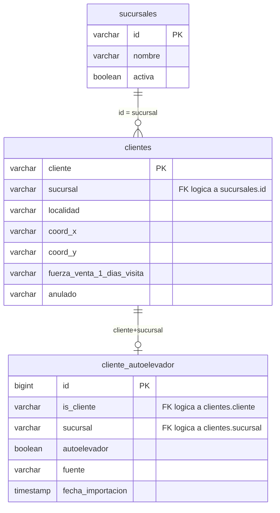
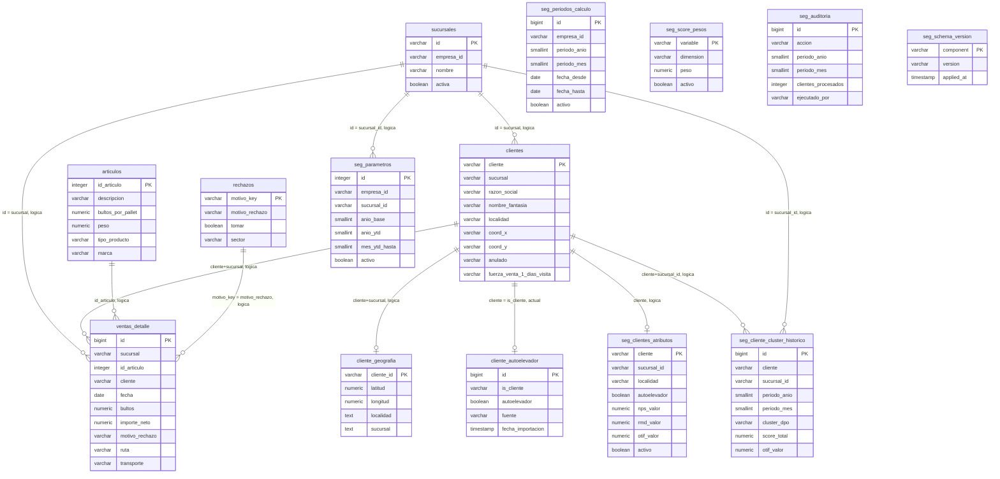
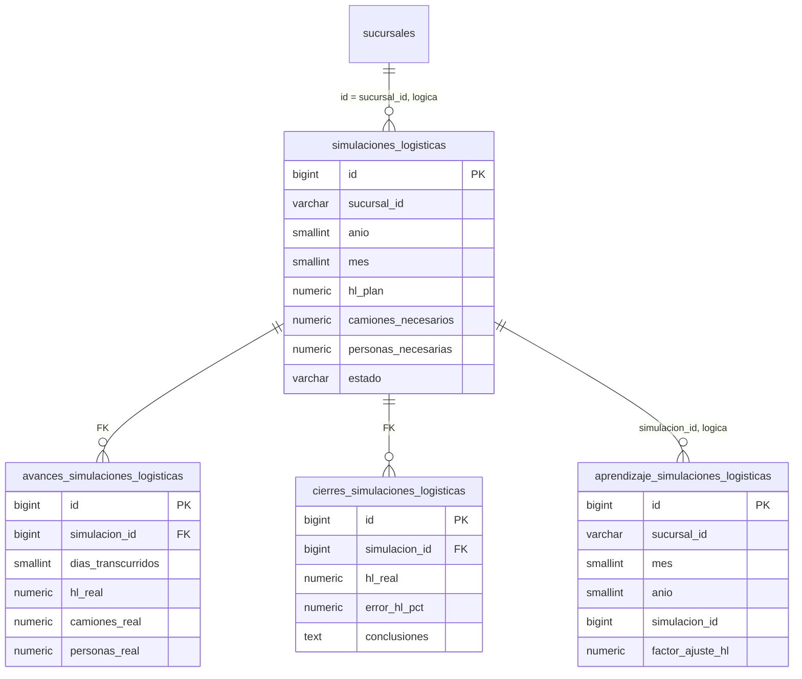
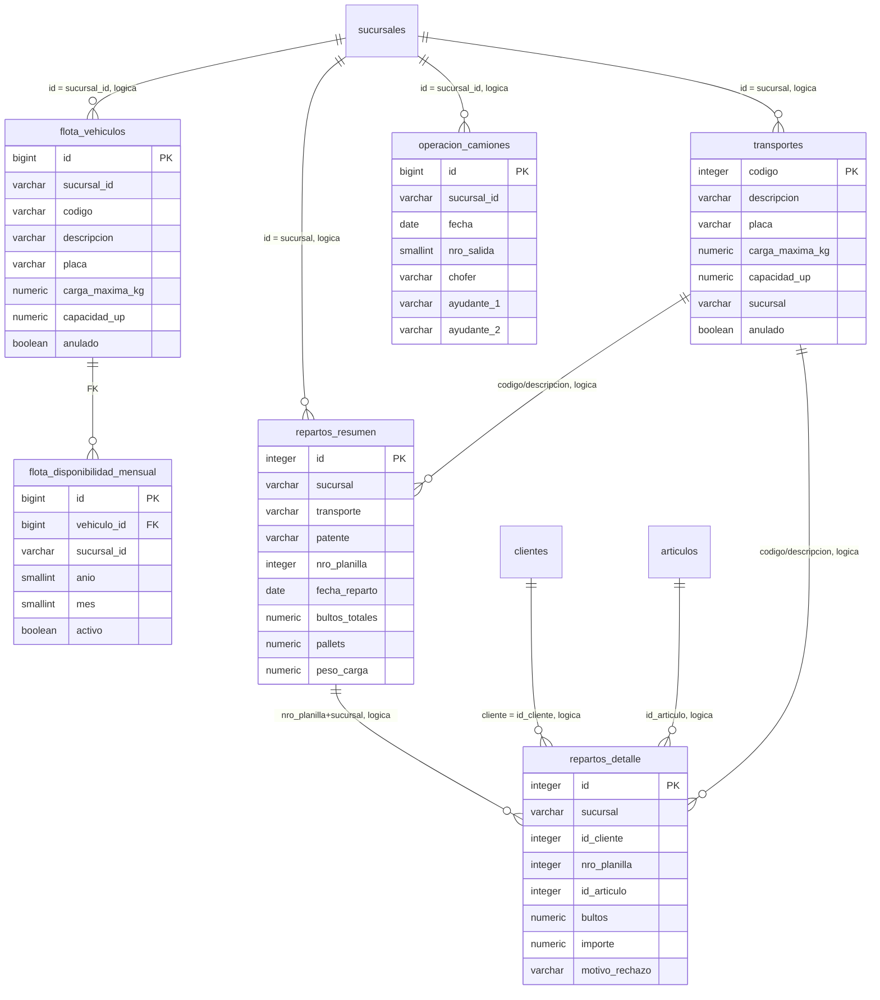
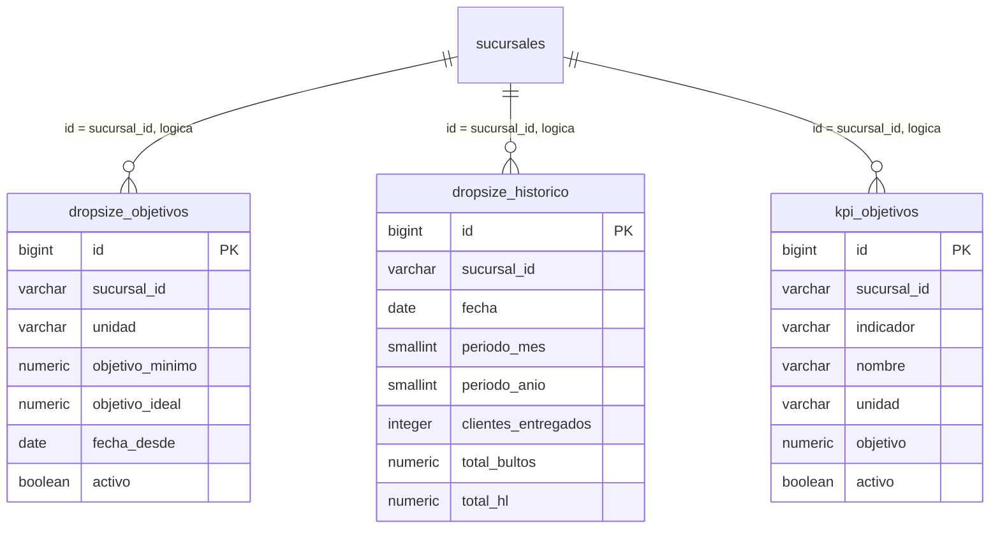
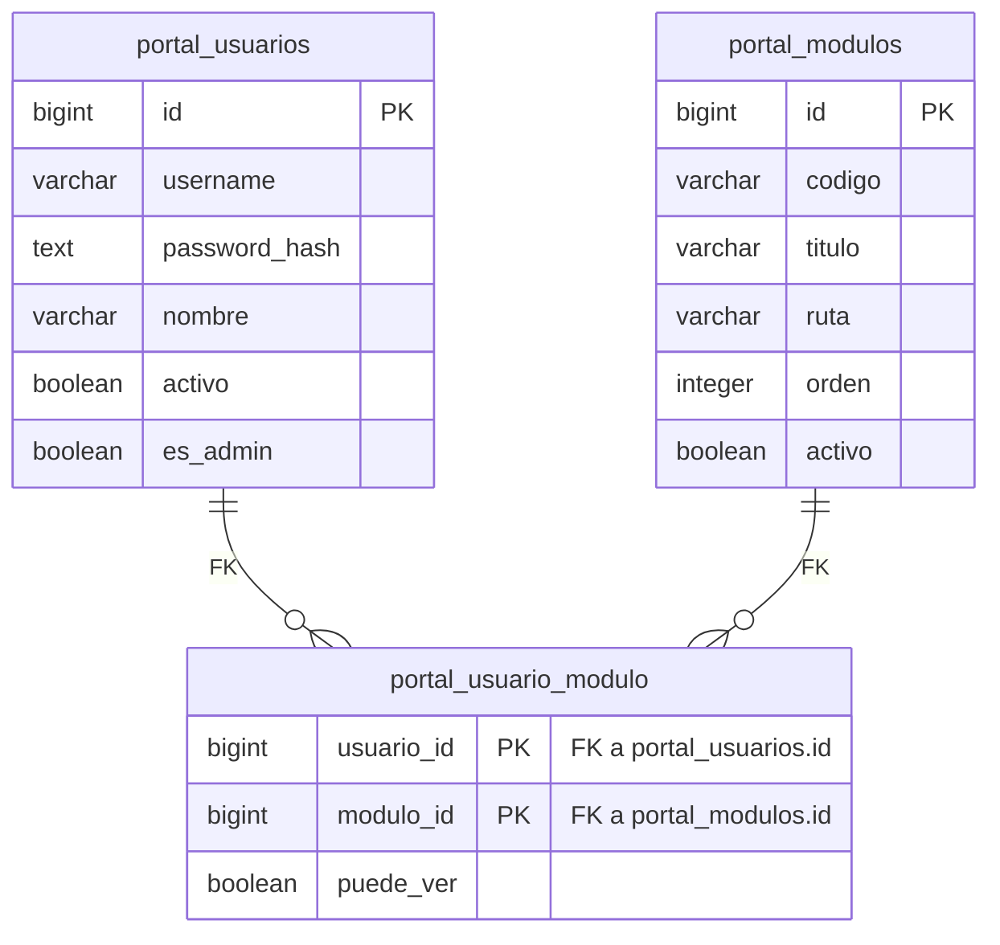
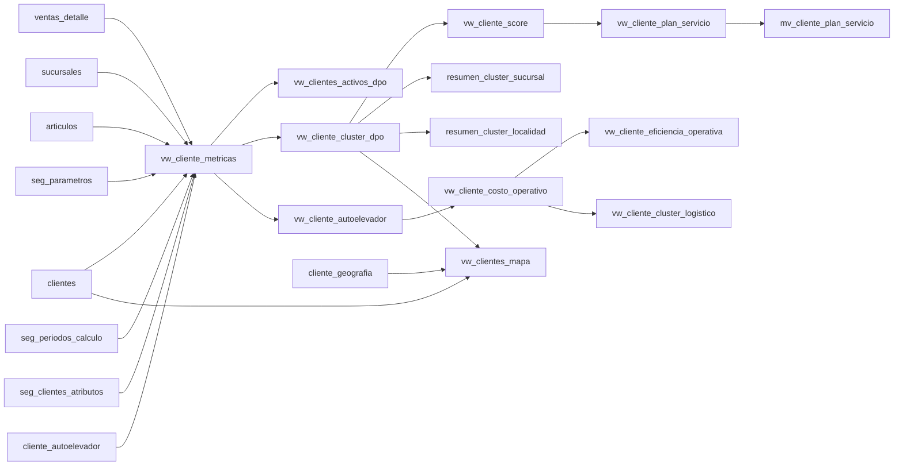

# ERD base de datos

Fuente: introspeccion de PostgreSQL schema `public` el 2026-05-26.

Convenciones:

- `PK`: clave primaria declarada.
- `FK`: clave foranea declarada en PostgreSQL.
- `FK logica`: relacion usada por la aplicacion, pero no declarada como constraint.
- Los diagramas muestran columnas de identidad y union. No listan todas las columnas descriptivas para mantenerlos legibles.

## Punto critico para autoelevador

La tabla actual `cliente_autoelevador` tiene `is_cliente`, pero no tiene `sucursal`.

Eso es insuficiente para el modelo real que definimos:

- `clientes` es la tabla maestra.
- Cada cliente del detalle debe unirse a `clientes` por `cliente + sucursal`.
- `cliente_autoelevador` tambien debe unirse por `is_cliente + sucursal`.

Diseno recomendado:



Regla de carga recomendada para el archivo de autoelevador:

```text
cliente,sucursal,autoelevador
10001,1,SI
10055,2,NO
```

Con indice unico recomendado:

```sql
UNIQUE (is_cliente, sucursal)
```

## Nucleo clientes, ventas y segmentacion



## Planificacion de picos y capacidad

```mermaid
erDiagram
    sucursales ||--o{ planificacion_picos : "id = sucursal_id, logica"
    sucursales ||--o{ planificacion_estadistica_diaria : "id = sucursal_id, logica"
    sucursales ||--o{ factor_estacionalidad : "id = sucursal_id, logica"
    sucursales ||--o{ configuracion_picos : "id = sucursal_id, logica"
    sucursales ||--o{ capacidad_operativa : "id = sucursal_id, logica"
    sucursales ||--o{ capacidad_mensual : "id = sucursal_id, logica"
    planificacion_picos ||--o{ planificacion_picos_real : "FK"
    planificacion_picos ||--o{ planificacion_picos_dias : "FK"
    planificacion_picos ||--o{ planificacion_picos_escenarios : "FK"
    planificacion_picos ||--o{ planificacion_variables_plan : "FK"
    planificacion_variables ||--o{ planificacion_variables_plan : "FK"
    planificacion_variables ||--o{ planificacion_variables_valores : "FK"

    planificacion_picos {
        bigint id PK
        varchar empresa_id
        varchar sucursal_id
        smallint anio
        smallint mes
        varchar estado
    }

    planificacion_picos_real {
        bigint id PK
        bigint planificacion_id FK
        numeric hl_real
        numeric bultos_real
        numeric camiones_promedio_real
        varchar estado_general
    }

    planificacion_picos_dias {
        bigint id PK
        bigint planificacion_id FK
        date fecha
        boolean es_pico
    }

    planificacion_picos_escenarios {
        bigint id PK
        bigint planificacion_id FK
        varchar nombre
        numeric hl_plan
    }

    planificacion_variables {
        bigint id PK
        varchar empresa_id
        varchar sucursal_id
        varchar codigo
        varchar nombre
        boolean activo
    }

    planificacion_variables_plan {
        bigint id PK
        bigint planificacion_id FK
        bigint variable_id FK
        numeric valor_base
        numeric valor_plan
        numeric valor_real
    }

    planificacion_variables_valores {
        bigint id PK
        bigint variable_id FK
        varchar sucursal_id
        date fecha
        numeric valor
    }

    planificacion_estadistica_diaria {
        bigint id PK
        varchar sucursal_id
        date fecha
        numeric hl
        numeric bultos
        integer salidas
        integer pdv_unicos
    }

    factor_estacionalidad {
        bigint id PK
        varchar sucursal_id
        smallint mes
        numeric factor_hl
        numeric factor_pdv
        numeric factor_salidas
    }

    configuracion_picos {
        bigint id PK
        varchar sucursal_id
        numeric umbral_pico_hl_pct
        numeric umbral_pico_salidas_pct
        boolean activo
    }

    capacidad_operativa {
        bigint id PK
        varchar sucursal_id
        date fecha
        numeric camiones_disponibles
        numeric choferes
        numeric acompanantes
    }

    capacidad_mensual {
        bigint id PK
        varchar sucursal_id
        smallint anio
        smallint mes
        integer camiones_disponibles
        integer choferes
        integer ayudantes
    }

    parametros_pico {
        varchar sucursal PK
        numeric umbral_pct
        varchar metrica
    }

    eventos_especiales {
        integer id PK
        date fecha
        varchar sucursal
        varchar descripcion
    }

    feriados {
        integer id PK
        date fecha
        varchar descripcion
        varchar tipo
    }
```



## Simulaciones logisticas



## Flota, camiones y repartos



## Dropsize, KPI y objetivos



## Portal



## Vistas principales de segmentacion

Las vistas no son tablas fisicas, pero explican el flujo de calculo del dashboard.



## Observaciones de normalizacion

1. La base tiene pocas FKs reales declaradas. La mayoria de relaciones son logicas por columnas como `sucursal`, `sucursal_id`, `cliente`, `id_cliente` e `id_articulo`.
2. Para no duplicar o cruzar datos entre sucursales, las uniones de cliente deben usar siempre `cliente + sucursal`.
3. `cliente_autoelevador` debe evolucionar de `UNIQUE(is_cliente)` a `UNIQUE(is_cliente, sucursal)`.
4. `clientes.fuerza_venta_1_dias_visita = dom/DOM` debe excluirse de clientes activos.
5. `clientes.coord_x` y `clientes.coord_y` son la fuente principal para el mapa; `cliente_geografia` puede quedar como cache o enriquecimiento.
